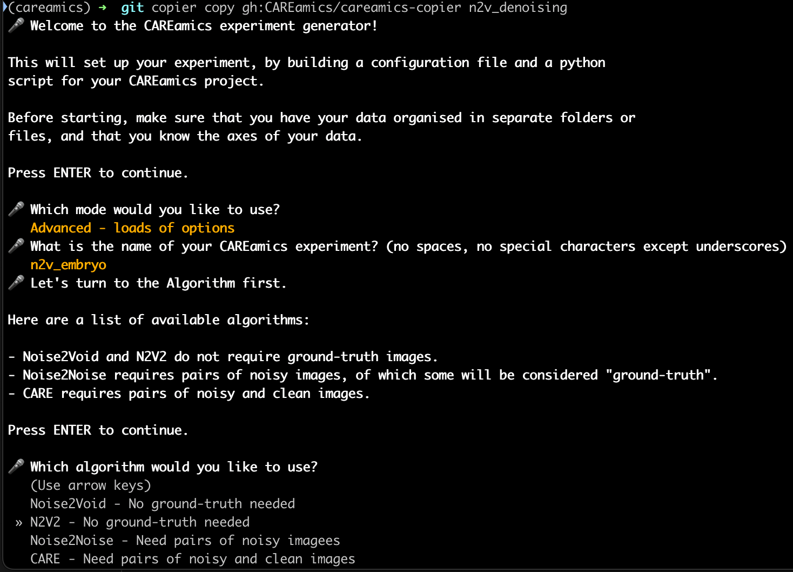

<p align="center">
  <a href="https://careamics.github.io/">
    
  </a>
</p>

# CAREamics copier template

[](https://github.com/CAREamics/careamics/blob/main/LICENSE)
[](https://pypi.org/project/careamics)
[](https://python.org)
[](https://forum.image.sc/)

The CAREamics copier template helps you build CAREamics scripts using intuitive prompting
in the console. The output is Python script that you can run to train and predict on 
your own data.

<p align="center">
  
</p>

At the end of the process, you will have created the following files:
```
my_project_name/
└── experiment_name/
    ├── experiment_name.py
    └── config.yaml
```

Where `experiment_name.py` is the main script that you can run to train and predict on your data. The `config.yaml` file contains the configuration for the experiment, which you can reuse in other contexts (e.g. with similar data).

## How to use CAREamics copier template

1. Install [CAREamics](https://careamics.github.io) in an environment.
2. Install [copier](https://copier.readthedocs.io/en/stable/) and black.
    ``` bash
    pip install copier black
    ```
3. Run copier with the CAREamics template.
    ``` bash
    copier copy gh:CAREamics/careamics-copier my_project_name
    ```

## Run the generated script

If your paths are correct, you can simply run the generated script with:
```bash
python my_project_name/experiment_name/experiment_name.py
```

Where `my_project_name` is the name you provided when running copier, and `experiment_name` is the name of the experiment you entered during the prompting process.

## The script does not work, what should I do?

First and foremost, make sure that the paths to your data are correct in the python script. You can modify them after the script has been generated.

If you encounter any issues with the generated script, please open an [issue](https://github.com/CAREamics/careamics-copier/issues).